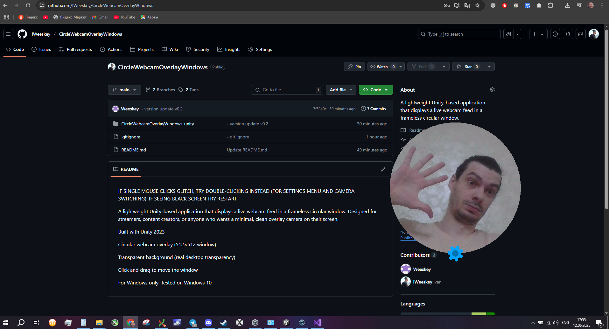

A lightweight Unity-based application that displays a live webcam feed in a frameless circular window. Designed for streamers, content creators, or anyone who wants a minimal, clean overlay camera on their screen.

INSTALLATION
1) Download latest release => https://github.com/IWeeskey/CircleWebcamOverlayWindows/releases
2) Unzip wherever you want
3) Launch CircleWebcamOverlay.exe

!!! IF SINGLE MOUSE CLICKS GLITCH, TRY DOUBLE-CLICKING INSTEAD (FOR SETTINGS MENU AND CAMERA SWITCHING) !!!
!!! IF SEEING BLACK SCREEN TRY RESTART !!!

Built with Unity 2023

Circular webcam overlay (512×512 window)

Transparent background (real desktop transparency)

Click and drag to move the window

For Windows only. Tested on Windows 10
